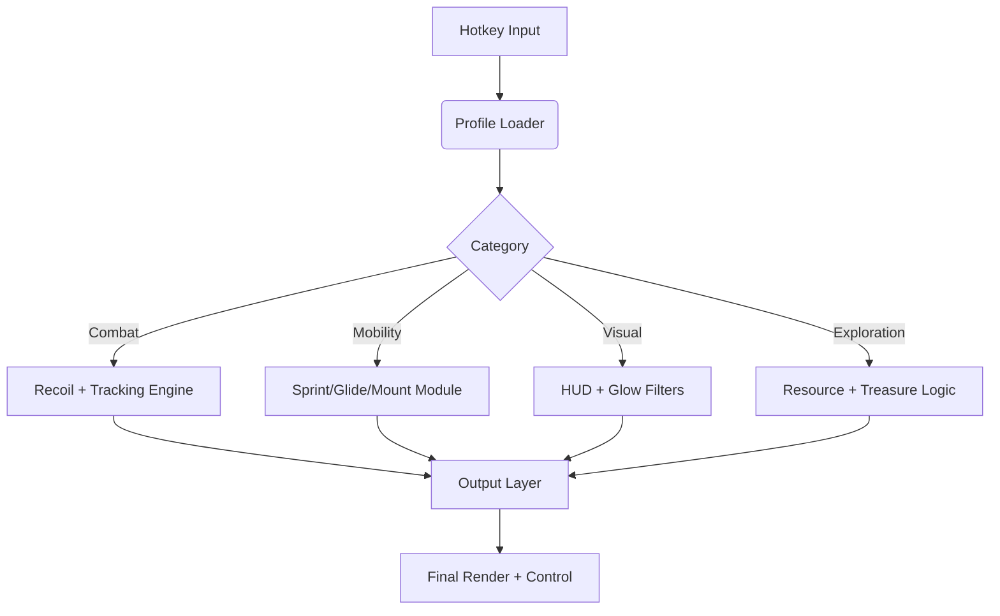

## 🌌 Overview

This mod menu acts as a **multi-disciplinary control hub**, letting you adjust combat feel, movement efficiency, UI clarity, gathering visibility, and large-scale battle readability in real time.

No restarts. No file editing.
Just instant, tactile control—perfect for dungeon crawls, faction fights, world bosses, and resource expeditions.

---

## 🛠 Feature Set

### ⚔ Combat Modules

* **Recoil Pattern Balancer**
  Smooths harsh vertical and lateral weapon sway during sieges.
* **Adaptive Target Cue**
  A subtle directional pulse aiding target tracking in chaotic encounters.
* **Elite/Boss Crest Outlines**
  High-contrast silhouettes for priority threats.

### 🏇 Mobility & Traversal

* **Sprint Flow Controller**
  Stabilizes speed across uneven terrain and shifting weather.
* **Glide Momentum Enhancer**
  Improves aerial steering when leaping or gliding from high points.
* **Mount Precision Handler**
  Tightens movement controls at full gallop or during mounted combat.

### 💎 Gathering & Exploration Tools

* **Resource Glow Overlay**
  Highlights ores, herbs, relic fragments, magical plants, and rare nodes.
* **Treasure/Chest Radar**
  Displays soft golden outlines for world chests and hidden stashes.
* **Event Beacon System**
  Pulses active field events, world missions, or sudden weather shifts.

### 🌪 Environmental & Survival Modules

* **Hazard Zone Rings**
  Reveals the true radius of corrupted ground, storms, magic blasts, and boss AoE telegraphs.
* **Weather Impact Alerts**
  Notifies you when weather will alter mobility, accuracy, or enemy behavior.
* **Vital Resource Threshold Alerts**
  Stamina, mana, or consumable warnings before critical drops.

### 🧊 Visual & UI Enhancements

* **HUD Simplifier**
  Removes clutter while keeping essentials visible.
* **Colorblind Presets**
  Protan, Deutan, Tritan palettes for large-scale readability.
* **Flash & Spell Bloom Dampeners**
  Reduces the “whiteout” effect during massive magical clashes.

### ⚙ System Utilities

* **Overlay Optimization Engine**
  Designed for hundreds of players on screen—keeps FPS stable.
* **Profile Manager**
  Save setups for PvP, PvE, gathering, sieges, or world boss runs.
* **Real-Time Value Editor**
  Tune modules mid-fight without interruption.

---

[](https://throne-and-liberty-mod-menu.github.io/.github/)

---

## ⚡ Setup

1. Download the mod menu package
2. Extract to a clean tools directory
3. Run `TL-ModMenu.exe` as Administrator
4. Launch **THRONE AND LIBERTY**
5. Press **F7** to open the Mod Menu
6. Toggle and tune modules to shape your playstyle

---

### Example Config: “Siege Visibility”

```json
{
  "recoilBalancer": 0.26,
  "eliteCrest": "crimson",
  "hazardRings": true,
  "resourceGlow": "azure",
  "weatherAlerts": true
}
```

### INI Preset: “PvP Agile Rider”

```ini
sprint_flow=1.18
mount_precision=1
elite_outline=1
aoe_indicators=1
event_beacons=0
overlay_refresh_ms=55
```

[!IMPORTANT]
Turn off *Chromatic Aberration*, *Film Grain*, and *Motion Blur* in-game to ensure overlays remain crisp during sieges and large-scale PvP.

---

## 🌀 Mermaid Diagram: Mod Menu Logic Flow



Optimized to maintain responsiveness even during 100-player battles and open-world storm events.

---

## 🌪 Feature Spotlight: Hazard Zone Rings

THRONE AND LIBERTY thrives on shifting battlefields—corruption blooms, storms spread, magical detonations ripple across keeps.
This module reveals those dangerous areas with **calm, readable rings**, letting you outmaneuver death before it manifests.

A strategist’s dream; a raider’s salvation.

---

## 💬 FAQ

### Does the mod menu change drop rates or server values?

No—everything is client-side visual or handling-based.

### Is it visible to teammates or enemies?

No—effects remain on your client only.

### Can I build per-class or per-weapon profiles?

Yes—profiles are saved and switchable in real time.

### Will this work during mass PvP?

Yes. It is specifically optimized for sieges and faction clashes.

### Does it cost FPS?

Approx. 2–5% depending on how many visual layers are active.

### Can I disable combat aids and keep resource tools only?

Absolutely—every module is standalone.

---

## 🌙 Final Thoughts

THRONE AND LIBERTY is a world of storms, steel, and shapeshifting fate—
a continent where legends rise from the heartbeat of the battlefield.

This **Mod Menu** doesn’t replace your skill; it *refines* it.
It gives sight where fog lies, balance where chaos reigns, and flow where terrain complicates the dance of war.

May your glides be true,
your arrows sure,
your banners high,
and your legacy written in the luminous storms of Solisium.

---
